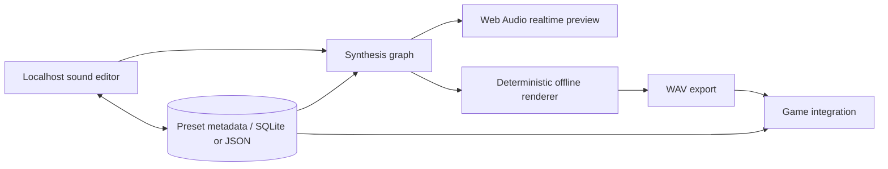

# Video Game Sound Effects as a Reusable Procedural System

This report treats game sound effects as **designed information-bearing signals**, not merely short audio files. It follows the supplied research brief, especially its emphasis on synthesis, procedural generation, taxonomy, reusable recipes, and a no-recording/no-sample workflow. fileciteturn0file0 fileciteturn0file1 The central recommendation is to make the localhost project's canonical asset a **parameterized sound recipe plus metadata and a random seed**; WAV files should be reproducible exports, not the source of truth.

## Executive summary

There is no single psychoacoustic property that makes a sound effect “satisfying.” Effective game SFX combine perceptual salience, causal timing, spectral distinctiveness, learned meaning, controlled expectation, and consistency with a game's audiovisual language. Experimental work on audiovisual timing also cautions against assuming that physical simultaneity is always perceptually or causally optimal: audiovisual synchrony depends on stimulus structure, task, temporal features, and learned action–outcome relationships. citeturn0search11turn0search5turn0search8

| Principle | Implication for the project |
|---|---|
| **Onsets matter disproportionately.** Attack time is an important timbral descriptor, and salient temporal features strongly influence audiovisual matching. citeturn1search12turn0search2 | Store `attackMs`, transient type, and transient spectrum as first-class parameters. |
| **Timbre carries identity.** Spectral centroid tracks perceived brightness, while attack characteristics and harmonic structure contribute strongly to timbral identification. citeturn1search12 | Categorize sounds by perceptual attributes such as `bright`, `dark`, `tonal`, `noisy`, `rough`, `metallic`, not only by semantic name. |
| **Material perception can be synthesized.** Controlled studies have successfully modeled impact sounds as sums of exponentially decaying sinusoidal modes, and listeners use sound to infer material. citeturn19search13turn19search16 | Build impact families from modal resonators rather than recordings. |
| **Urgency is designable.** Fundamental frequency, harmonic structure, envelope, repetition speed, pitch range, rhythm, and inharmonicity have experimentally measurable effects on perceived urgency. citeturn19search0turn19search9turn19search14 | Create an `urgency` macro that controls several parameters coherently rather than simply increasing volume. |
| **Roughness is an unusually strong danger/salience cue.** Rapid amplitude modulation in roughly the tens-to-low-hundreds-of-hertz region can increase aversion and salience. citeturn1search15 | Reserve controlled roughness for alarms, electricity, damage, hostile systems, and exceptional states. |
| **Masking is an information-design problem.** Masking depends on spectral and temporal relationships; spatial separation can also improve segregation in appropriate listening conditions. citeturn0search13turn0search14turn10search20 | Give simultaneous game events different spectral, temporal, and spatial “addresses.” |
| **Repetition needs variation.** Repetition changes neural responses to repeated auditory stimuli and reduces novelty responses. citeturn1search2turn1search7turn1search5 | Store bounded randomization with every frequently repeated preset. |
| **Variation should preserve identity.** Randomness that changes every perceptual dimension destroys learnability. | Randomize within a recognizable “family envelope”: perhaps ±3% timing, ±2–5% pitch, modest filter/Q changes, alternate modal weighting, while preserving the core contour. |
| **Audio feedback works partly because players learn causality.** Action–outcome prediction can tighten audiovisual temporal binding. citeturn0search8 | Make input feedback immediate and consistently tied to the same action semantics. |
| **Realism is subordinate to communication.** Material, urgency and audiovisual research shows that listeners infer causes from selected acoustic cues rather than requiring literal physical reproduction. citeturn19search13turn19search14 | Exaggerate the features that matter: stronger transient for contact, lower resonances for mass, clearer pitch gesture for success. |
| **Procedural audio is especially appropriate for interaction.** *Vessel* tied custom synthesized/processed sound to physics and gameplay, while Microsoft demonstrated real-time physical/modal sound systems for impacts and interaction. citeturn2search0turn10search2turn10search7 | Keep collision, machine, movement, environmental and UI families parameter-driven. |
| **The best localhost representation is not `foo.wav`; it is a reproducible recipe.** Browser Web Audio provides synthesis/processing graphs, including offline rendering; AudioWorklet provides custom low-latency DSP. citeturn3search3turn3search6 | Save graph + parameters + semantic metadata + random seed; render WAV only on export. |

The resulting design philosophy is:

> **Event meaning → perceptual target → synthesis structure → parameter variation → deterministic render → reusable metadata.**

That is a stronger foundation for a reusable SFX library than organizing a folder of prerecorded files by filenames.

## Perception, taxonomy, and sound as information

A useful model separates three questions that are often conflated:

**Where does the sound conceptually exist?**  
Diegetic, transdiegetic/meta, or non-diegetic.

**What job does it perform?**  
Feedback, ambience, UI, warning, reward, material cue, musical punctuation, etc.

**How is it generated?**  
Fixed asset, synthesized preset, procedural model, adaptive graph.

This matters because “UI,” “procedural,” and “diegetic” are not mutually exclusive categories. A procedurally synthesized reactor is diegetic; a procedurally synthesized health warning is non-diegetic. Jørgensen's concept of transdiegetic sound is particularly useful for game audio because some sounds deliberately connect game-world events with player-facing information rather than fitting neatly inside or outside the represented world. citeturn2search16

```mermaid
flowchart TD
    A[Game Audio]

    A --> D[Diegetic]
    A --> T[Transdiegetic / Meta]
    A --> N[Non-diegetic]

    D --> D1[Impacts / footsteps / machines]
    D --> D2[Creatures / weapons / vehicles]
    D --> D3[Environmental ambience]

    T --> T1[World event emphasized for player]
    T --> T2[State cue attached to world object]
    T --> T3[Adaptive perceptual exaggeration]

    N --> N1[UI feedback]
    N --> N2[Warnings / status]
    N --> N3[Rewards / achievements]
    N --> N4[Stingers / musical SFX]

    A -. independent axis .-> I[Implementation]
    I --> I1[Synthesized]
    I --> I2[Procedural]
    I --> I3[Fixed audio]
    I --> I4[Adaptive]

    A -. independent axis .-> F[Function]
    F --> F1[Inform]
    F --> F2[Orient]
    F --> F3[Reward]
    F --> F4[Characterize]
    F --> F5[Immerse]
```



**Functional taxonomy**

| Class | Definition for the library | Typical examples |
|---|---|---|
| **Diegetic** | Has an apparent source in the represented world. | Footsteps, impact, engine, door, machinery, environmental water. |
| **Non-diegetic** | Exists primarily in the player-facing information layer. | Menu click, error, objective complete, health alert. |
| **Transdiegetic/meta** | Deliberately bridges world state and player communication. The term is analytically useful rather than a universal middleware category. citeturn2search16 | Enhanced lock-on tone attached to a target; supernatural heartbeat communicating health. |
| **UI** | Input/state acknowledgement. Usually extremely short and highly repeatable. | Hover, click, confirm, cancel, disabled. |
| **Ambience** | Establishes environment or persistent state rather than one discrete event. | Wind, machinery bed, electrical field. |
| **Musical SFX** | Effect whose pitch/interval/rhythm is an important part of its semantic identity. | Pickup arpeggio, level-up gesture. |
| **Stinger** | Short, conspicuous punctuation event. | Boss reveal, achievement, failure. |
| **Adaptive** | Behavior changes in response to game state. | Engine RPM, low-health pulse, wind with weather intensity. |
| **Procedural** | Audio itself is synthesized or transformed from parameters during generation/runtime. | Modal impact, synthesized footsteps, generated wind. |

### Why particular acoustic dimensions matter

**Attack and transient.** A fast attack makes event boundaries easy to locate temporally. Attack time is a meaningful timbral feature, while audiovisual synchronization experiments show that salient temporal changes are important to cross-modal matching. citeturn1search12turn0search5 In a game mix, this makes the transient the natural place to communicate “something happened now.”

**Amplitude and pitch envelopes.** The time evolution of a sound often carries more information than its static spectrum. A rapidly decaying burst says “impact”; a sustained plateau says “state”; an accelerating pulse says “increasing urgency.” Warning experiments show that envelope, repetition speed and pitch behavior can systematically alter perceived urgency. citeturn19search0turn19search8

**Timbre.** Spectral centroid has a strong relationship to perceived brightness, while attack and harmonic structure contribute to categorization. citeturn1search12 Thus a tiny UI sound can be distinguished from another not by being louder, but by being shorter, brighter, hollower, rougher, more tonal, or more noise-like.

**Harmonic versus inharmonic content.** Harmonic spectra support stable pitch and instrument-like identity; introducing inharmonic relationships can make a sound more metallic, unstable or alarm-like. Experiments on warning signals found inharmonicity among the acoustic parameters influencing semantic judgments and urgency. citeturn19search9turn19search14 FM synthesis is particularly useful here because changing oscillator frequency ratios moves continuously between harmonic and inharmonic families. citeturn9search1

**Spectrum.** “Bright,” “dark,” “thin,” and “heavy” are not simply EQ presets, but spectrum provides strong handles. A broad high-frequency transient improves onset salience; low-frequency energy and slowly decaying low modes can be used artistically to imply a larger energetic event. The latter is a design convention rather than a universal psychophysical law and should be tested against the game's visuals.

**Masking.** Two effects occupying the same time and frequency region compete. Studies of auditory masking show substantial changes in detection thresholds as temporal-envelope relationships change, while spatial separation can improve segregation under suitable reproduction conditions. citeturn0search13turn10search20 The practical goal is therefore not “make important sounds louder,” but **make their identifying features non-overlapping**.

**Spatialization.** Position primarily communicates source direction and scene geometry; reverberation/propagation provides additional environmental information. Physically based game-audio research has modeled occlusion, diffraction and reverberant propagation because these change the perceptual relationship between source and listener. citeturn10search9turn10search10

**Synchronization.** Do not blindly align every peak to the exact animation frame. Research shows that perceived simultaneity and perceived causality can have different optima, and audiovisual binding changes with temporal structure and prediction. citeturn0search1turn0search6turn0search8 For responsive controls, however, minimizing unnecessary system latency remains desirable because the sound is part of the action–outcome loop.

**Reward and feedback.** A reward sound becomes meaningful because it repeatedly predicts or confirms a valued state. The action–outcome literature shows that learned prediction can affect audiovisual temporal binding. citeturn0search8 A game can therefore build an auditory vocabulary progressively: a small positive gesture for ordinary success and increasingly distinctive extensions for rarer rewards.

**Habituation.** Repeated auditory stimuli show reduced responses in multiple experimental paradigms, and familiarity alters novelty responses. citeturn1search2turn1search7turn1search5 This supports variation for high-frequency events such as footsteps and hits, but it does **not** mean every playback should be radically different.

### Sound as information

A reusable SFX library should explicitly encode what each effect communicates.

| Information | Useful acoustic variables | Separation strategy |
|---|---|---|
| Event occurred | Sudden onset, transient | Reserve a clean time-frequency transient |
| Importance | Duration, bandwidth, layer count, level | Increase multiple dimensions rather than level alone |
| Direction | Binaural/stereo position | Do not over-widen unrelated UI effects |
| Distance | Level, HF loss, direct/reverb relationship | Preserve identifying mid-band content |
| Size/mass | Lower resonances, longer resonant decay as an artistic cue | Separate from “material” parameters |
| Material | Modal frequencies, damping, noise/resonance balance | Metal, wood, glass families get different modal distributions |
| Velocity/force | Transient amplitude, brightness, saturation, excited modes | Nonlinear mapping prevents every hard hit becoming the same |
| Danger | Repetition rate, pitch range, roughness, inharmonicity | Reserve these cues so ordinary UI does not sound alarming |
| Rarity | Distinct contour, additional harmonics/layers, longer punctuation | Make rare events unlike routine rewards |
| Success/failure | Learned pitch/timbre/rhythm families | Maintain consistent motif grammar |
| Hidden state | Repetition, modulation, evolving ambience | Use continuously mapped parameters |
| Availability | Brightness, bandwidth, transient definition | “Unavailable = duller” is a useful convention, not a universal law |

Experiments on auditory warning semantics are a useful warning against simplistic mappings: pitch, speed, inharmonicity and rhythm have statistically reliable associations, but not every adjective maps cleanly onto every acoustic parameter. citeturn19search14 Consequently, the localhost database should distinguish **evidence-backed perceptual attributes** from **project-specific semantic conventions**.

A compact sound grammar could therefore use:

`positive/progress → short upward contour + consonant tonal components`

`warning → faster recurrence + increased pitch range + controlled roughness`

`heavy → lower modal family + substantial body + slower decay`

`precise → very fast attack + short duration + high-frequency definition`

`inactive → reduced bandwidth + weaker transient`

`rare/significant → extra layer + extended tail + distinctive interval`

The first four have partial support from auditory-warning, timbre, roughness and impact-perception research; the exact “positive = rising” and “inactive = filtered” meanings should be treated as learned design conventions and user-tested rather than universal psychoacoustic facts. citeturn19search0turn19search14turn1search12turn19search16

## Effect anatomy and digital synthesis

The most useful generic decomposition for the project is:

**transient + body + texture + resonance + tail**

Not every effect needs all five. A UI tick may be almost entirely transient; wind may have no discrete transient at all.

### Component anatomy

| Category | Transient | Body | Texture | Resonance | Tail |
|---|---|---|---|---|---|
| UI click | 2–10 ms impulse/noise | Tiny tonal tick | Sparse | Optional short high mode | Essentially none |
| Confirmation | Clean click | Two/three pitched notes | Clean harmonics | Mild | Short |
| Error | Harder onset | Low or dissonant tones | Rough/modulated | Optional | Short |
| Pickup | Bright transient | Upward pitch gesture | Sparkle | Tonal | 100–400 ms |
| Achievement | Clear onset | Chord/arpeggio | Multiple bright partials | Musical | Longer punctuation |
| Footstep | Noise/contact spike | Low thump | Surface-dependent noise | Short modes | Very short |
| Punch | Broad transient | Low sine/noise thump | Saturation | Little | Short |
| Heavy impact | Hard onset | Very-low body | Broadband debris | Several damped modes | Longer low tail |
| Sword clash | Sharp metallic click | Inharmonic ringing | High noise scrape | Multiple slowly damped modes | Medium |
| Explosion | Noise impulse | Falling low-frequency body | Distorted broadband noise | Weak/chaotic | Filtered noise decay |
| Laser | Sharp start | Swept oscillator/FM | Optional noise | Tonal | Delay/reverb optional |
| Electricity | Irregular clicks | High-mid noisy energy | Fast modulation | Weak | Irregular |
| Magic | Soft/bright transient | Harmonic/FM tones | Generated grains/noise | Tonal resonances | Diffuse synthetic tail |
| Engine | None after start | Harmonic pulse train | Noise/roughness | RPM-linked | Continuous |
| Machine hum | None | Fundamental + harmonics | Low noise | Stable | Continuous |

Impact-sound research is particularly relevant to the resonance column: modal models represent objects as collections of damped oscillatory modes, and both academic experiments and game-audio research have used such models to synthesize plausible impact families. citeturn19search16turn10search2turn10search7

### Synthesis techniques under the hard “no recorded samples” rule

The restriction changes the meaning of several familiar techniques.

**Primitive oscillators.** Sine waves are ideal for sub-bodies, clean resonance and modal banks. Triangle waves add gentle upper harmonics. Saw and pulse waves give dense harmonic material suitable for machines, retro effects and subtractive synthesis.

**Noise.** White noise is broadband and useful for transients, explosions, air and electrical texture. Pink/brown-like noise emphasizes progressively lower frequencies and is useful for fuller wind, rumble and environmental beds. These can be generated algorithmically; no asset is required.

**Subtractive synthesis.** Begin with spectrally rich oscillators/noise and shape them with low-pass, high-pass, band-pass and resonant filters. It is particularly efficient for wind, machines, UI effects and retro sounds.

**Additive synthesis.** Explicitly sum sinusoids:

\[
x(t)=\sum_{k=1}^{N} A_k(t)\sin(2\pi f_k t+\phi_k)
\]

This is ideal when the resonances themselves are the design material: bells, metal, glass, achievement tones and synthetic materials. Large additive systems can scale to very high sinusoid counts, although game SFX usually need far fewer. citeturn9search17

**FM synthesis.** A simple form is

\[
x(t)=A\sin(2\pi f_c t + I\sin(2\pi f_m t))
\]

where the ratio \(f_m/f_c\) and modulation index \(I\) control spectral structure. Chowning's FM work demonstrates how modulation can produce both harmonic and inharmonic timbres efficiently. citeturn9search1 It is unusually effective for metallic hits, lasers, engines, electricity, bells and “magical” synthetic timbres.

**Wavetable synthesis.** Under the project rules, generate tables mathematically—harmonic sums, waveshaped curves, equations—not from recordings. Wavetable methods are useful for continuously morphing machines and engines; AES work has also investigated wavetable approaches specifically for engine-sound generation. citeturn9search21

**Granular synthesis.** Granular processing is normally associated with sample material, but it remains compatible with the hard constraint when the grain source is a **generated oscillator/noise buffer**. GameSynth's procedural particle model is an industry example of granular methods for complex textures. citeturn6search7turn6search1 It suits water, magic, sparks, granular debris and dense ambience.

**Physical and modal modeling.** Model the behavior rather than recording the result. Impact synthesis research has demonstrated real-time modal approaches, while physically based game-audio systems have mapped simulated object interactions into audio. citeturn2search22turn10search2turn10search7 This is the strongest route for a general-purpose `MaterialImpact` generator.

**Resonators.** Excite band-pass filters or damped sinusoidal modes with an impulse/noise burst. Change mode ratios and damping to move between wood-like, ceramic-like, glassy and metallic families.

**Waveshaping/distortion.** Apply \(y=f(x)\), for example `tanh(k*x)`, to increase spectral density. Excellent for explosions, engines, impacts and aggression, but should normally follow gain control to avoid turning everything into the same broadband sound.

**AM/ring modulation.** Multiplying signals creates modulation sidebands; rapid AM can create buzz and roughness. Controlled rapid modulation is particularly appropriate to alarming/electrical textures given the known salience of acoustic roughness. citeturn1search15

**Delay, chorus, flanging and phasing.** These are useful for widening or adding motion to generated tonal material. They should normally be secondary modifiers rather than the defining event cue.

**Reverb.** Algorithmic reverb is fully compatible with the project. Reverberation affects how source characteristics are interpreted, although listeners show substantial contextual adaptation. citeturn19search16

**Convolution.** Conventional convolution reverb generally relies on a recorded impulse response and therefore violates the strict rule. It is acceptable only when the impulse response is itself generated algorithmically.

### Synthesis cheat sheet

| Desired perception | Starting strategy |
|---|---|
| **Precise** | Very fast attack + short decay + clear high-mid transient |
| **Heavy** | Strong transient + lower modal/body components + longer low-frequency decay |
| **Tiny** | Short duration + higher resonances + very little low-frequency body |
| **Metallic** | Inharmonic/modal partial bank + long unequal decays + sharp excitation |
| **Wooden** | Few strongly damped resonances + short noise/contact transient |
| **Glassy** | Sparse high-Q modes + high-frequency content + cleaner excitation |
| **Mechanical** | Harmonic pulse train + cyclic modulation + modest noise |
| **Electrical** | Band-limited noise + irregular impulses + rapid AM/ring modulation |
| **Dangerous** | Increased repetition rate + pitch range/inharmonicity + optional controlled roughness. citeturn19search0turn19search9turn1search15 |
| **Magical** | Additive/FM harmonics + generated grains + pitch movement + diffuse algorithmic tail |
| **Explosive** | Broadband transient + falling LF body + nonlinear saturation + noisy tail |
| **Air/wind** | Generated noise → slowly moving band-pass/low-pass filters |
| **Water** | Filtered noise bed + stochastic resonant droplets + generated granular texture |
| **Rewarding** | Distinctive clean onset + learned melodic/timbral gesture + greater novelty than routine feedback |
| **Retro** | Pulse/square/triangle/noise + simple pitch/envelope modulation |

## Recipes, procedural mapping, and controlled variation

The following are **design recipes rather than claims that there is one objectively correct synthesis for each object**. They deliberately amplify perceptually useful features highlighted by work on attack, brightness, modal material perception, roughness and audiovisual timing. citeturn1search12turn19search16turn1search15turn0search11 Every source signal below is generated.

### Practical synthesis recipes

| Effect | Digital-only recipe | Perceptual rationale |
|---|---|---|
| **Click** | 2–8 ms white-noise impulse → HPF around high-mid region → 10–30 ms exponential decay | Broadband onset makes timing obvious; extreme brevity prevents clutter. |
| **Confirmation** | Short sine/triangle note → second note a consonant interval above → 40–100 ms envelopes | Retains click-like immediacy while giving the event a repeatable tonal identity. |
| **Error** | Sharp pulse/noise transient + two close or inharmonic tones → short decay → optional light rough AM | Spectral instability and roughness distinguish “problem” from benign UI. |
| **Pickup** | Bright triangle/sine → rapid upward pitch sweep or 2–3-note ascent → tiny sparkle-noise layer | Upward movement is easily recognizable as a learned positive gesture; brightness helps it survive a busy mix. |
| **Power-up** | Rising oscillator sweep + progressively opened low-pass filter + additive upper partials → short wide tail | Increasing bandwidth/pitch creates expansion and escalating energy. |
| **Achievement** | Clean transient → 3–5-note generated arpeggio/chord → additive upper partials → algorithmic reverb | Longer structure and richer harmonic content differentiate rare success from routine confirmation. |
| **Jump** | Short noise foot impulse + sine/triangle pitch sweep upward → 100–250 ms decay | The continuous upward gesture mirrors departure from the ground without requiring realism. |
| **Landing** | Noise impact + falling 120→50 Hz sine/triangle body → optional material resonators | Abrupt contact marks timing; downward body gives contrast with the jump. |
| **Punch** | 1–5 ms broadband impulse + 60–120 Hz sine burst + filtered-noise body → mild saturation | Sharp onset communicates contact; LF body exaggerates force. |
| **Heavy impact** | Impulse → several low/mid modal resonators + falling sub-sine + low-passed debris noise → 300–800 ms decay | Multiple slowly decaying modes imply a larger resonant event. |
| **Sword clash** | Impulse → 5–12 inharmonic sine/resonator modes → short high-passed scrape noise → unequal decays | Inharmonic long-lived modes strongly differentiate metal-like ringing from dull impacts. |
| **Explosion** | White/pink noise burst → waveshaper → rapidly falling 100→35 Hz sine → band-limited noise tail with moving LPF | Broadband attack marks blast; downward LF component supplies body; evolving noise prevents a static “synth note.” |
| **Laser** | Sine/FM oscillator with exponential frequency sweep → amplitude decay → optional short feedback delay | Strong pitch trajectory makes the event unmistakable even at low duration. |
| **Electricity** | Band-passed noise + stochastic 1–10 ms impulses + rapidly varying AM/ring modulation → resonant peaks | Irregular micro-events and rapid modulation suggest unstable electrical energy. |
| **Magic spell** | Additive or FM tone + slow pitch modulation + generated micro-grains → shimmer-like delays/reverb | Combines pitched identity with nonmechanical moving detail. |
| **Engine** | Pulse/saw oscillator bank whose fundamental follows RPM → harmonic weighting → noise → saturation → LPF | Frequency, harmonic spacing and roughness all change continuously with engine state rather than looping a file. |
| **Machine hum** | 50–150 Hz fundamental + integer harmonics + low-level noise + small periodic AM/FM | Stable periodicity suggests persistent machinery while modulation prevents sterile constancy. |
| **Footstep** | 2–10 ms contact noise + low thump + 3–6 short resonators selected by synthetic `surface` model | Contact, body and resonances can be independently mapped to gait, mass and material. |
| **Water** | Pink/white noise → moving band-pass filters + randomized resonant “droplets” + grains from generated noise | A large number of low-level stochastic micro-events creates continuous complexity without recordings. |
| **Wind** | Pink/brown-like noise → several slowly drifting band-pass filters → very slow amplitude modulation | Continuous noise supplies air-like broadband energy; filter motion prevents obvious looping. |
| **UI hover** | 10–30 ms filtered triangle/noise tick, lower level than click | Provides acknowledgment while deliberately reserving stronger transient energy for activation. |
| **Cooldown ready** | Narrow bright transient + two-note upward interval + brief harmonic shimmer | A distinctive compact motif can become a learned “available again” signal. |
| **Shield hit** | Sharp impulse → short FM burst → high-Q resonator bank → rapidly fading synthetic shimmer | More tonal and elastic than a conventional material hit, differentiating “energy” from physical armor. |
| **Servo/door mechanism** | Low saw/pulse → pitch ramp tied to movement velocity + cyclic AM + end-stop impact | Continuous parameter mapping makes duration automatically follow animation rather than stretching a file. |

These recipes intentionally avoid prerecorded impulses, convolution IRs, wavetable samples and source recordings.

### Procedural audio as parameter mapping

The project should think in this form:

```text
game event
    ↓
semantic parameters
    ↓
perceptual parameters
    ↓
synthesis graph
    ↓
bounded stochastic variation
    ↓
audio
```

For example:

```text
collision
mass       = 0.82
speed      = 0.64
material   = "metal"
angle      = 0.31
size       = 0.75
seed       = 183742

        ↓

transientGain = f(speed)
bodyFreq      = g(size, mass)
modeDecay     = h(material, size)
modeSpread    = k(material)
brightness    = j(speed, angle)
distortion    = q(speed)
```

Physics-driven and modal game-audio research has demonstrated exactly this general class of approach: simulated impact properties can select or drive physically meaningful synthesis parameters instead of selecting one prerecorded clip. citeturn10search2turn10search7 *Vessel* likewise linked physics/game events to a custom dynamic audio system and used techniques including sequencing, spectral layering, modulation, asymmetric loops and granulation. citeturn2search0

A practical mapping matrix:

| Game variable | Candidate synthesis mapping |
|---|---|
| Velocity | transient gain, brightness, distortion, number of excited modes |
| Mass | body level, modal decay, low-frequency weighting |
| Object size | inverse relationship to main resonant frequency; modal density |
| Material | mode ratios, damping, transient/noise ratio |
| Contact angle | transient brightness/noise proportion |
| Surface roughness | noise bandwidth and stochastic micro-impulses |
| Health | pulse rate, filter cutoff, roughness, pitch instability |
| Vehicle RPM | fundamental frequency and harmonic spacing |
| Acceleration/load | harmonic richness, distortion, noise |
| Wind speed | noise gain, filter center, modulation depth |
| Distance | attenuation, HF reduction, direct/reverberant relationship |
| Threat level | repetition, pitch range, inharmonicity, roughness |
| Reward rarity | layer count, harmonic richness, tail duration, motif elaboration |

Mappings should usually be **curved and clamped**, not naïvely linear:

```text
impactEnergy = clamp(speed² * mass, 0, 1)
transientGain = sqrt(impactEnergy)
brightness = 0.25 + 0.75 * impactEnergy
bodyFreq = lerp(180, 45, sqrt(size))
decay = 0.08 + 0.9 * size * materialResonance
```

This allows the first half of the gameplay range to remain expressive without letting extreme game values produce unusable audio.

### Controlled randomness

The goal is **variation without semantic drift**. Repetition research supports the need to consider habituation and novelty, but randomized design should not turn a recognizable cue into a different message every time. citeturn1search2turn1search5

Use three layers:

**Micro-variation:** tiny timing, gain, detuning and filter changes.  
**Structural variation:** alternate resonator weights, number of particles, optional noise layer.  
**Contextual variation:** game variables themselves alter the patch.

A representative reusable preset might store:

```json
{
  "id": "impact.metal.medium",
  "seed": 183742,
  "taxonomy": {
    "diegesis": "diegetic",
    "function": "impact",
    "material": "metal"
  },
  "perception": {
    "weight": 0.62,
    "brightness": 0.73,
    "roughness": 0.18,
    "urgency": 0.28
  },
  "params": {
    "transientMs": 4,
    "bodyHz": 105,
    "decayMs": 490,
    "modeRatios": [1.0, 1.47, 2.13, 3.82, 5.19]
  },
  "variation": {
    "pitchPct": 2.5,
    "gainDb": 1.2,
    "decayPct": 8,
    "modalWeightPct": 12
  },
  "provenance": {
    "source": "synthesized",
    "recordingsUsed": false
  }
}
```

The **seed is important**. Given the same recipe version and seed, the renderer should produce the same sound. That makes generated audio testable, cacheable, diffable and reproducible.

## Implementation, tools, and localhost architecture

As of August 23, 2026, the strongest fit for this specific prototype is **TypeScript + Web Audio API**, with generated JSON recipes as canonical assets. Web Audio defines a graph-based API for synthesis and processing; its offline context allows graph rendering without real-time playback, while AudioWorklet supports custom processing on the audio-rendering path. citeturn3search3turn3search6



### Tool comparison

Licensing and pricing are current to the cited vendor pages where time-sensitive details are given.

| Tool | License / cost model | Authoring style | Real-time / offline | Export / game integration | Best fit here |
|---|---|---|---|---|---|
| **Pure Data** | Open source; Pd repository uses a BSD-style license. citeturn4search1turn4search4 | Visual patching | Excellent real-time; offline/export workflows possible | `libpd` can embed Pd and has wrappers for several languages. citeturn4search14 | Excellent experimental DSP/procedural prototype |
| **SuperCollider** | Open-source GPLv3. citeturn4search12 | Code + server architecture | Excellent realtime and non-real-time synthesis | Custom integration required | Excellent for algorithmic/procedural research |
| **Csound** | LGPL 2.1-or-later project. citeturn3search12 | Text/orchestra + APIs | Realtime and offline. citeturn3search13 | Render files or embed via API | Excellent synthesis laboratory |
| **Web Audio API** | Web standard implemented by browsers; no middleware license | JavaScript/TypeScript audio graph | `AudioContext` realtime; offline rendering; AudioWorklet custom DSP. citeturn3search3turn3search6 | Browser-native; encode rendered buffers to WAV | **Best localhost-first choice** |
| **sfxr / bfxr family** | Varies by implementation; for example SFXR-Qt is MIT. citeturn13search4 | Compact parameter sliders | Typically generate/preview effects | SFXR-Qt exports WAV; several ports integrate directly into engines. citeturn13search0turn13search4 | Excellent model for compact procedural preset design |
| **GameSynth** | Proprietary commercial software | Visual procedural models | Interactive procedural authoring; optional engine/API integration | Supports workflows toward Wwise, FMOD and Unity; vendor exposes an API. citeturn6search8turn6search6 | Strong specialized game-SFX authoring reference |
| **REAPER** | Proprietary, DRM-free license; fully functional 60-day evaluation. Current REAPER 7 licenses cover updates through 8.99. citeturn15search2turn15search4 | DAW + JSFX + scripting | Real-time effects and offline render | C/C++ extensions; ReaScript including EEL2/Lua/Python; JSFX. citeturn5search13 | Excellent finishing/batch-processing environment, less ideal as canonical synth format |
| **VCV Rack** | Rack's open-source code is GPLv3+; plugin licenses vary. citeturn5search2 | Visual modular synthesis | Primarily real-time | Standalone/plugin workflows depend on edition | Excellent synthesis exploration; weaker as web-app core |
| **Unreal MetaSounds** | Included within Unreal licensing; for games, Epic currently applies royalties after $1M lifetime gross product revenue under the standard model. citeturn20search12 | Node-based DSP graph | Runtime, sample-accurate procedural synthesis | Native Unreal integration | Excellent final destination for an Unreal project |
| **Unity / C#** | Unity Personal is currently free below $200k annual revenue/funding; Pro is required above that threshold under 2026 terms. citeturn20search0turn20search8 | C# + engine audio | Runtime procedural PCM possible | `AudioClip.Create` PCM callbacks and `OnAudioFilterRead` provide generated/custom audio paths. citeturn7search17turn7search13 | Good runtime port target |
| **FMOD Studio** | Proprietary; current licensing includes free/paid tiers depending on developer/project size. citeturn6search3 | Event/middleware authoring | Runtime adaptive audio | C++/C# APIs and Unity/Unreal integrations. citeturn6search3 | Excellent integration/mixing layer after synthesis |
| **Wwise** | Proprietary; current official pricing offers an Indie tier subject to project-budget criteria. citeturn8search0 | Event/container/middleware graph | Runtime adaptive audio | RTPCs and APIs/WAAPI enable parameterized and automated workflows. citeturn8search4turn8search1 | Excellent large-project runtime layer |

### Direct code approaches

**JavaScript / Web Audio**

The core browser implementation can be very small:

```js
function playClick(ctx, brightness = 0.8) {
  const osc = new OscillatorNode(ctx, {
    type: "triangle",
    frequency: 900 + brightness * 1600
  });

  const gain = new GainNode(ctx, { gain: 0 });
  const now = ctx.currentTime;

  gain.gain.setValueAtTime(0.35, now);
  gain.gain.exponentialRampToValueAtTime(0.0001, now + 0.025);

  osc.connect(gain).connect(ctx.destination);
  osc.start(now);
  osc.stop(now + 0.03);
}
```

The same graph can be constructed in an `OfflineAudioContext` for deterministic export rather than real-time playback. citeturn3search3turn3search6

**Python**

Python is useful for batch/offline validation even if it is not the production renderer:

```python
import math
import random

def synth_laser(sample_rate=48000, duration=0.25, seed=1):
    rng = random.Random(seed)
    frames = int(sample_rate * duration)
    phase = 0.0
    out = []

    for i in range(frames):
        t = i / sample_rate
        u = t / duration

        freq = 1600.0 * ((180.0 / 1600.0) ** u)
        amp = (1.0 - u) ** 2

        phase += 2.0 * math.pi * freq / sample_rate
        noise = (rng.random() * 2.0 - 1.0) * 0.02

        out.append(amp * (math.sin(phase) + noise))

    return out
```

**C/C++**

The same architecture reduces to a sample/block renderer:

```cpp
for (int i = 0; i < numFrames; ++i) {
    float t = float(sampleIndex + i) / sampleRate;

    float env = expf(-t * decayRate);
    float body = sinf(phase);
    float noise = nextNoise(seed);

    output[i] = env * (body * bodyGain + noise * noiseGain);

    phase += 2.0f * PI * frequency / sampleRate;
}
```

This makes a useful long-term architecture: implement primitives such as oscillator, noise, envelope, filter, resonator, waveshaper and delay once, then deserialize recipes into DSP graphs.

**Unity / C#**

Unity exposes procedural-generation paths through `AudioClip.Create` PCM callbacks and `OnAudioFilterRead`; the latter runs on Unity's audio thread, so heavyweight allocation/game logic should stay out of the callback. citeturn7search17turn7search13

```csharp
void OnAudioFilterRead(float[] data, int channels)
{
    for (int i = 0; i < data.Length; i += channels)
    {
        float sample = RenderNextSample();

        for (int ch = 0; ch < channels; ch++)
            data[i + ch] = sample;
    }
}
```

**Unreal / MetaSounds**

MetaSounds is effectively the Unreal-native version of the proposed graph model: Epic describes it as a high-performance DSP graph with sample-accurate control that can be driven by gameplay data. citeturn5search0turn5search8 A conceptual impact patch is simply:

```text
OnImpact
   ├─> Noise Burst ─> Envelope ──────────────┐
   ├─> Sine(bodyFreq) ─> Envelope ──────────┤
   └─> Modal/Filter Bank ─> Envelope ───────┤
                                             ├─> Waveshaper -> Output
velocity -> transientGain / brightness ------┤
mass     -> bodyFreq / decay ----------------┤
material -> mode frequencies / damping ------┘
```

Epic's *Valley of the Ancient* example demonstrated a fully procedural MetaSound whose behavior adapted to a gameplay `ChargeDuration` parameter, making it a useful model for game-state-driven synthesis. citeturn5search4

### Recommended localhost data model

The main database entity should be `SfxPreset`, not `AudioFile`.

```text
SfxPreset
├── identity
│   ├── id
│   ├── name
│   ├── version
│   └── seed
├── taxonomy
│   ├── diegesis
│   ├── function
│   ├── event
│   ├── material
│   └── tags[]
├── perception
│   ├── brightness
│   ├── weight
│   ├── roughness
│   ├── tonality
│   ├── urgency
│   └── spatialWidth
├── graph
│   ├── generators[]
│   ├── envelopes[]
│   ├── modulators[]
│   └── processors[]
├── mappings[]
├── variation
├── provenance
└── renderSettings
```

This enables searches such as:

```text
function:impact material:metal weight:>0.7 brightness:>0.5
```

or

```text
diegesis:non-diegetic function:reward urgency:<0.4
```

instead of relying on filenames like `good_click_final_07.wav`.

## Open audio sources, licensing, and reuse

External SFX should remain **optional** for this project: they violate the core synthesis-only generation constraint, but an asset directory is still useful for reference, future hybrid modes and legally reusable exceptions.

The critical distinction is between **free to download** and **licensed to redistribute/use commercially**. Creative Commons CC0 is a public-domain dedication/fallback tool; CC BY permits commercial adaptation and redistribution subject to attribution and related requirements; CC BY-SA permits commercial use but applies ShareAlike to adaptations. citeturn14search2turn14search0turn14search1 Other rights such as privacy, publicity and trademarks can remain relevant even when copyright permission is broad. citeturn14search0turn14search2

This is project-design guidance rather than legal advice.

### License policy

| Status | Commercial game policy |
|---|---|
| **CC0** | Preferred external-asset category. Attribution is not imposed by CC0; retain provenance anyway. citeturn14search2 |
| **Public domain** | Usually acceptable, but verify jurisdiction/source and other rights. |
| **CC BY 4.0** | Commercial use is allowed; preserve creator attribution, license reference and modification notice as applicable. citeturn14search0 |
| **CC BY-SA 4.0** | Commercial use is allowed; adaptations must satisfy ShareAlike requirements. citeturn14search1 |
| **CC BY-NC** | Exclude from commercial-game production. Freesound explicitly distinguishes its noncommercial license from commercial-compatible alternatives. citeturn11search1 |
| **GPL applied to an audio asset** | Avoid for this library unless the redistribution implications have been deliberately reviewed. GPL is principally a software-oriented copyleft framework and is unnecessary complexity for a reusable SFX corpus. |
| **“Royalty free”** | Do not interpret as public domain or open source. Record the actual contract/license terms. |
| **No stated license** | Treat as copyrighted/unusable rather than assuming download availability is permission. |

### Open audio resource directory

| Repository/source | What licensing actually looks like | Commercial suitability |
|---|---|---|
| **Kenney audio packs** | Kenney states its game assets on asset pages are CC0 and usable commercially; current examples include UI Audio, Interface Sounds, Impact Sounds, RPG Audio and Digital Audio. citeturn17search14turn17search12turn17search15turn17search18turn17search22 | **Excellent.** Probably the cleanest external reference corpus here. |
| **Freesound** | Hosts CC0, CC BY and CC BY-NC sounds; license must be checked per item. citeturn11search1 | **Good only with filters and stored license metadata.** CC0 is safest; BY requires attribution; reject BY-NC for commercial release. |
| **OpenGameArt** | Contains multiple licenses including CC0, CC BY, CC BY-SA and software-oriented licenses; commercial use depends on the selected item's license terms. citeturn11search0 | **Good but heterogeneous.** Ingest individual assets, never “the site.” |
| **Wikimedia Commons** | Hosts free-license and public-domain media, but each file's information page must be checked and other rights may apply. citeturn12search0turn12search4 | **Good with per-file validation.** |
| **Internet Archive** | The Archive explicitly says it does **not** guarantee the copyright status of items or uploader rights metadata. citeturn18search0 | **High due-diligence burden.** Use only items with independently credible rights provenance. |
| **NASA audio collections** | NASA says its content is generally not subject to U.S. copyright, but usage guidelines, third-party content, identifiers, endorsement restrictions and personality rights require attention. citeturn17search2turn17search9 NASA's 2026 Artemis Audio Library explicitly says its sounds are available for reuse under NASA's media guidelines. citeturn17search1 | **Useful, but not equivalent to CC0.** Preserve NASA attribution and rights notes. |
| **NOAA PMEL Acoustics** | PMEL states that material on its acoustics pages is public information unless otherwise noted and requests citation to NOAA PMEL. citeturn18search2 | **Useful for environmental/reference audio**, while checking exceptions. |
| **itch.io packs** | License is creator-specific rather than something inherent in “being on itch.io.” | Use only when an individual asset has explicit CC0/acceptable commercial terms and preserve a copy/reference to those terms. |
| **GitHub audio repositories** | A repository being publicly visible does not itself resolve asset rights. | Require an explicit license applying to the audio directory/files, not merely assumptions based on source-code availability. |
| **Research datasets** | Frequently have dataset-specific terms and may inherit licenses from component recordings. | Best treated as research/reference data until commercial asset rights have been audited. |

For the localhost system, every imported external asset should therefore carry:

```json
{
  "provenance": {
    "type": "external",
    "creator": "...",
    "source": "...",
    "license": "CC0-1.0",
    "licenseCheckedAt": "2026-08-23",
    "attributionRequired": false,
    "commercialUseChecked": true,
    "rightsNotes": "...",
    "sha256": "..."
  }
}
```

For synthesized effects:

```json
{
  "provenance": {
    "type": "procedural-original",
    "recordedSources": false,
    "downloadedAudioSources": false,
    "generatorVersion": "0.1.0",
    "seed": 183742
  }
}
```

That difference should be visible in the UI.

## Classic constraints and modern procedural case studies

Classic game hardware is useful less because contemporary games should imitate “8-bit” aesthetics and more because constrained systems reveal the power of **small, orthogonal sound vocabularies**.

The NES APU, for example, exposes two pulse channels, a triangle channel, a noise channel and a DMC path; its synthesis-oriented channels demonstrate how melody, low body and noise/percussion can remain perceptually distinct despite a tiny palette. citeturn16search12 Yamaha's YM2612, closely associated with Mega Drive/Genesis audio, is an OPN-family FM sound chip; FM's compact control over rich harmonic and inharmonic spectra explains why this class of hardware could support unusually varied synthetic timbres with few operators. citeturn16search7turn9search1

Across Atari-era programmable sound, NES/Famicom, Game Boy-style pulse/wave/noise systems, FM-based Mega Drive/Genesis hardware and SID-era synthesis, the recurring design constraint was a small number of programmable voices and relatively direct control over oscillator/noise behavior. The reasonable modern inference is not that these constraints *proved* stronger design, but that they encouraged designers to distinguish events with **waveform, register, rhythm, envelope and pitch contour** rather than relying on hundreds of near-duplicate recordings.

That lesson maps directly to this project:

```text
Instead of:
150 unrelated WAV files

Prefer:
8 synthesis primitives
× 6 envelope archetypes
× 8 modal/material profiles
× contextual parameter mappings
= a very large but coherent sound vocabulary
```

### Modern case studies

| Case | Documented technique | Relevance |
|---|---|---|
| **Vessel — Leonard Paul, GDC** | The game's custom audio system used FMOD/Lua with Pure Data/OSC prototyping; the talk describes physics-driven triggering, sequencing, layering, spectral layering, modulation, asymmetric loops and granulation, with custom sound design rather than reliance on a conventional pre-existing SFX library. citeturn2search0 | Probably the closest direct precedent for this project. It shows that a game's sonic identity can emerge from systems and synthesis rather than a giant sample library. |
| **No Man's Sky — Paul Weir, GDC** | Alongside conventional audio, the project used custom generative systems including a physically modeled vocal-tract synthesizer for creature voices and generative/adaptive music logic. citeturn2search1 | Demonstrates why generative systems are valuable when the visual/game world itself is combinatorial. |
| **Crackdown II / Microsoft Research impact synthesis** | Microsoft researchers developed modal impact synthesis aimed at generating variation in real time with lower storage requirements than sets of prerecorded alternatives; the technique was deployed in *Crackdown II*. citeturn10search2 | Strong evidence for using `material + force + modal model` instead of round-robin impact WAVs. |
| **Physically based interactive sound — Microsoft Research** | Interactive physical simulations drove synthesized contact sounds, including impacts/rolling and related physical state. citeturn10search7turn2search22 | Supports direct `simulation state → acoustic parameters` design. |
| **Unreal Valley of the Ancient** | Epic documents a procedural MetaSound whose charge sound adapts through gameplay parameters such as `ChargeDuration`. citeturn5search4 | A clean contemporary example of keeping audio behavior tied to a gameplay variable rather than stretching/retriggering a fixed clip. |

These examples suggest three useful categories for the local library:

**Parametric one-shots** — click, laser, impact, reward.  
**Physical families** — footsteps, impacts, rolling, materials.  
**Continuous state models** — engines, machines, wind, electricity.

That classification may be more useful for implementation than “UI / weapon / ambience” alone.

## Workflow, learning path, prototype recommendation, and bibliography

### Minimal solo-developer workflow

A repeatable workflow should separate *meaning* from *implementation*:

| Stage | Question | Artifact |
|---|---|---|
| Define event | What happened? | `event = "player_land"` |
| Define information | What must the player know? | `force, surface, playerWeight` |
| Define perceptual target | Heavy? precise? dangerous? rewarding? | Perceptual-vector metadata |
| Select primitive structure | Noise? oscillator? FM? modal bank? | Synthesis graph |
| Design temporal shape | Where are onset/body/tail? | Envelopes |
| Design spectral identity | What region/components carry recognition? | Oscillators, filters, modes |
| Map gameplay | Which game variables should alter sound? | Parameter mappings |
| Add bounded variation | What may change without changing meaning? | Seeded random ranges |
| Test in context | Does another sound mask it? Does it match the animation? | Gameplay mix test |
| Export/version | Can the exact render be recreated? | Recipe version + seed + WAV |

The most important testing step is **not solo playback**. Auditory masking and audiovisual integration research both show that perception changes substantially when temporal, spectral and cross-modal context change. citeturn0search13turn0search6 A beautiful isolated effect can be a poor game effect if it disappears under music or obscures more important feedback.

### Beginner learning path

| Phase | Learn | Build |
|---|---|---|
| **Oscillator** | frequency, phase, sine/triangle/pulse/saw | confirm tone, pickup |
| **Envelope** | attack, decay, exponential vs linear shapes | click, jump, laser |
| **Noise** | white/pink/brown-like generation | wind, impact transient |
| **Filtering** | LP/HP/BP/Q | UI families, wind |
| **Layering** | transient/body/texture | punch, explosion |
| **Modulation** | AM, FM, LFO, pitch envelopes | electricity, machine |
| **Additive/modal** | resonant modes + damping | metal, glass, heavy impact |
| **Nonlinearity** | saturation/waveshaping | engine, explosion |
| **Stochastic synthesis** | seeded randomization | footsteps, water |
| **Procedural mapping** | game variables → DSP parameters | impacts, engine RPM |
| **Spatial treatment** | position, attenuation, environment | world emitters |
| **Integration** | engine/runtime parameter APIs | Unity, Unreal, FMOD/Wwise |

### Recommended localhost prototype

For this particular project, I would **not start with Pure Data, FMOD, Wwise, Unreal or Unity** as the canonical authoring environment. They are excellent downstream tools, but all introduce project/runtime assumptions that the reusable SFX library does not yet need.

The recommended core is:

```text
TypeScript
+
Web Audio API
+
AudioWorklet for custom DSP
+
OfflineAudioContext for export
+
JSON preset/graph format
+
seeded PRNG
+
SQLite or simple JSON index for metadata
+
WAV encoder
```

Web Audio's standardized graph model and offline rendering are especially well aligned with a localhost editor, while custom processing can move into AudioWorklet when standard nodes are insufficient. citeturn3search3turn3search6

Start with only these DSP primitives:

```text
Oscillator
Noise
Gain
Envelope
Biquad filter
Pitch envelope
AM
FM
Delay
Waveshaper
Modal resonator bank
Mixer
Stereo panner
```

Do not implement granular synthesis, convolution, elaborate physical modeling or a plugin architecture initially. They can be added after the 30-sound milestone demonstrates where the primitive set is insufficient.

**The first synthesis-only library should contain roughly:**

| Family | Presets |
|---|---|
| **UI × 10** | hover, click, confirm, cancel/back, error, disabled, toggle-on, toggle-off, slider/tick, modal/open |
| **Interaction × 10** | jump, landing, light punch, heavy impact, metal clash, shield hit, laser, explosion, footstep, servo/door |
| **Environment × 5** | wind, water, electricity bed, machine hum, engine |
| **Reward/status × 5** | pickup, power-up, achievement, cooldown-ready, major-objective-complete |

Each should have at least three semantic macros:

```text
intensity
size/importance
variation
```

and, where appropriate:

```text
material
speed
urgency
distance
```

A browser editor could expose both **expert DSP controls** and **semantic macros**:

```text
              SFX: Heavy Impact

Meaning
[ Weight      0.78 ]
[ Force       0.65 ]
[ Metallicity 0.20 ]
[ Brightness  0.35 ]

Variation
[ Amount      0.12 ]
[ Seed      183742 ]

Advanced
Transient  3.5 ms
Body       72 Hz
Modes       5
Decay      540 ms
Drive      0.19
```

The semantic controls are important because the eventual value of the project is not simply synthesizing sounds—it is building a **searchable design space**.

A particularly useful long-term query model would be:

```text
"Give me a diegetic, medium-weight impact that is
less metallic than impact.metal.03,
brighter than impact.wood.02,
and safe to repeat five times per second."
```

That becomes practical only if semantic, perceptual and synthesis metadata are stored alongside the graph.

### Grouped bibliography

**Psychoacoustics and audiovisual perception**

- *Perceiving audiovisual synchrony: quantitative synthesis of 185 studies* — broad evidence that audiovisual synchrony judgments are context-dependent rather than governed by one universal offset. citeturn0search11
- Research on temporal-frequency limits and salient audiovisual temporal features. citeturn0search2turn0search5
- Research on audiovisual temporal structure/complexity. citeturn0search6
- Research showing effects of action–outcome learning/prediction on audiovisual temporal binding. citeturn0search8
- Research separating perceptual simultaneity from perceived audiovisual causality. citeturn0search1
- Auditory masking research concerning temporal envelopes and informational masking. citeturn0search13turn0search14
- Timbre research relating spectral centroid to brightness and attack time to timbral characterization. citeturn1search12
- Research on acoustic roughness and salience/aversiveness. citeturn1search15
- Auditory habituation/repetition studies. citeturn1search2turn1search7turn1search5
- Spatial release/masking research in spatial audio. citeturn10search20

**Auditory information design**

- Edworthy, Loxley & Dennis, *Improving Auditory Warning Design: Relationship between Warning Sound Parameters and Perceived Urgency*. citeturn19search0turn19search2
- Hellier, Edworthy & Dennis, work quantifying the effects of speed, frequency, repetition and inharmonicity on perceived urgency. citeturn19search9
- Edworthy, Hellier & Hards, *The semantic associations of acoustic parameters commonly used in the design of auditory information and warning signals*. citeturn19search14
- Work on auditory material perception and audiovisual material integration. citeturn19search13turn19search16

**Game-audio theory**

- Kristine Jørgensen, *On transdiegetic sounds in computer games*. citeturn2search16
- Inger Ekman, *Meaningful Noise: Understanding Sound Effects in Computer Games*. citeturn2search18

**Procedural and physically based audio**

- Leonard Paul, GDC, *The Dynamic Audio of Vessel*. citeturn2search0
- Paul Weir, GDC, *The Sound of No Man's Sky*. citeturn2search1
- Microsoft Research / ACM, *Sound Synthesis for Impact Sounds in Video Games*. citeturn10search2
- Microsoft Research work on interactive physically based sound synthesis. citeturn10search7turn10search5
- Microsoft Research work on real-time sound propagation, diffraction, occlusion and reverberation. citeturn10search9turn10search10
- Perry Cook, Princeton, work on physically modeled real-time sound synthesis. citeturn10search17

**Sound synthesis**

- John Chowning / AES material on FM synthesis and harmonic/inharmonic timbral construction. citeturn9search1
- AES research on large-scale real-time additive synthesis. citeturn9search17
- AES work on wavetable-based engine sound generation. citeturn9search21
- Physically based wave-simulation sound synthesis research. citeturn10search0

**Tools and APIs**

- W3C Web Audio API specifications/editor's draft. citeturn3search3turn3search6
- Pure Data project and `libpd`. citeturn4search1turn4search14
- SuperCollider project. citeturn4search12
- Csound project/documentation. citeturn3search12turn3search13
- GameSynth official materials. citeturn6search7turn6search8turn6search6
- REAPER official site and extension/scripting API. citeturn15search2turn5search13
- Unreal Engine MetaSounds documentation. citeturn5search0turn5search8
- Unity procedural audio APIs. citeturn7search17turn7search13
- FMOD Studio official product/licensing information. citeturn6search3
- Audiokinetic Wwise licensing/API documentation. citeturn8search0turn8search4turn8search1

**Open and reusable audio**

- Kenney's CC0 asset policy and audio packs. citeturn17search14turn17search12turn17search15
- Freesound licensing FAQ. citeturn11search1
- OpenGameArt licensing FAQ. citeturn11search0
- Wikimedia Commons reuse/licensing guidance. citeturn12search0turn12search4
- Internet Archive rights guidance, notably its explicit warning that it cannot guarantee item copyright status. citeturn18search0
- NASA media-use guidance and audio collections. citeturn17search2turn17search1
- NOAA PMEL Acoustics multimedia and reuse guidance. citeturn18search2

**Licensing**

- Creative Commons CC0 1.0. citeturn14search2
- Creative Commons Attribution 4.0. citeturn14search0
- Creative Commons Attribution-ShareAlike 4.0. citeturn14search1

The practical conclusion is that the localhost project should be conceived as a **small procedural-audio language and catalog system**, not an SFX downloader. The reusable object is:

```text
SFX =
semantic role
+ perceptual target
+ synthesis graph
+ gameplay mappings
+ bounded variation
+ deterministic seed
+ provenance
```

That architecture directly addresses the two recurring problems identified by the research: game sounds need to remain **perceptually readable in context**, and frequently repeated sounds need enough structured variation to avoid becoming mechanically repetitive while preserving their learned identity. citeturn0search13turn1search2turn19search14 It also aligns closely with documented procedural-game-audio practice in *Vessel*, physics/modal impact synthesis, *No Man's Sky*, and modern MetaSound systems. citeturn2search0turn10search2turn2search1turn5search4